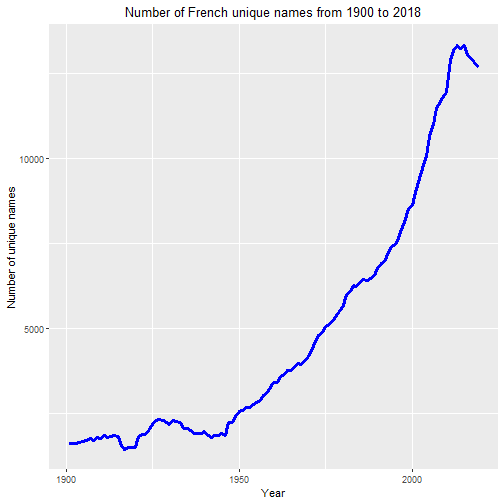
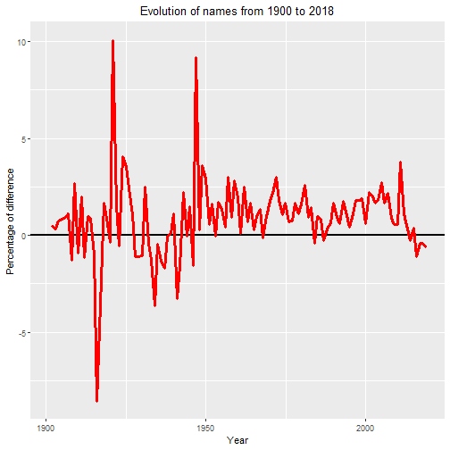

The evolution of french firsname from the twentieth century to our days
========================================================
author: Camille Bason - Hugo Broucke
date: November 14th, 2019
autosize: true

Summary
========================================================

- Idea

- Data

- Preliminary Findings - Descriptive statistics

- Preliminary Findings - Correlations between firstnames and the society

- Plans for process ahead

Idea
========================================================

- Use the data from INSEE (French National Institute of Statistics and Economic Studies) about french firsnames to talk about the evolution of it over time

- Inspiration:
  - Website article of Slate that explains why some firsnames gained or loss in popularity over time (http://www.slate.fr/life/74937/donnees-prenom-france-evolution)
  - Website article from Topito that gives 10 weird firstnames (such as "Burger") that are allowed by civil status (http://www.topito.com/top-prenoms-autorises-etat-civil)

- Do a project in two parts:
  - Give some general stats about french names : 
    ~ Evolution of the number of distinct names over time
    ~ Most popular names according to french regions over time
  - Try to see why are some names popular :
    ~ Focus on some names that suddenly became popular
    ~ Check correlation between firstname's popularity and gross domestic product of french regions
    
Data
========================================================

- 2 datasets from INSEE (5https://www.insee.fr/fr/statistiques/2540004#consulter) : one about data for whole country (4 features), one about data for regions (5 features):
  - gender of the firstname
  - firstname
  - year
  - occurence's number of the name for the given year
  - region (only for the second dataset)
  

- 1 dataset from ...


```r
summary(data_nat_clean)
```

```
      sex            firstname           year            number       
 Min.   :1.000   ALIX     :   238   2014   : 13753   Min.   :    3.0  
 1st Qu.:1.000   ANGE     :   238   2012   : 13747   1st Qu.:    4.0  
 Median :2.000   CAMILLE  :   238   2013   : 13666   Median :    8.0  
 Mean   :1.544   DOMINIQUE:   235   2011   : 13606   Mean   :  137.7  
 3rd Qu.:2.000   CLAUDE   :   232   2015   : 13436   3rd Qu.:   24.0  
 Max.   :2.000   HYACINTHE:   228   2016   : 13331   Max.   :53706.0  
                 (Other)  :599812   (Other):519682                    
```

Preliminary findings - Descriptive statistics
========================================================




```r
#Adding difference for each year
distinct_names$ratio <- ((distinct_names$n_names-lag(distinct_names$n_names))/
                           (distinct_names$n_names+lag(distinct_names$n_names))*100)
```



Preliminary Findings - Correlations between firstnames and the society
========================================================

ajouter travail camille

Plans for process ahead
========================================================

- Try to implement an interactive map of France with its regions that will show the most popular name for each region for each gender (the user should be able to select the year in order for him to see the map of France with the most popular firstnames for this year)

- Link the data to an economic variable (GDP...) to see if there is a correlation between some firstnames patterns and region economy
